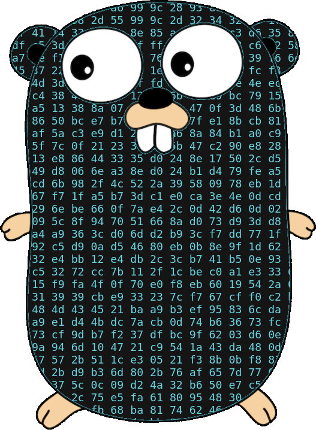
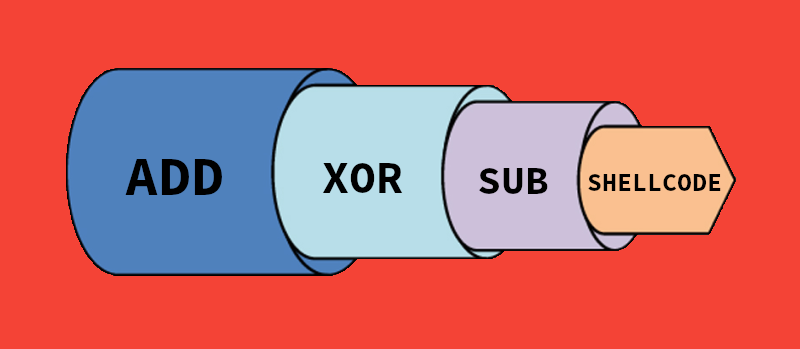

# Polygo

<p align="center">
  
</p>
<p align="center">
  <b>Polymorphic Linux x86 shellcode engine</b>
</p>


## Introduction

Polygo is polymorphic shellcode engine made in Go.

## 💡 Features 

* Polymorphism
* No NULL bytes
* Shellcode x86
* Cross-plateform engine
* Multiple obfuscation methods
* Multi-layer encapsulation
* Crazy mode

## Functionning

### 🌑 Obfuscation methods

Polygo uses predefined assembly stubs (decoders) for each obfuscation method (`ADD`, `SUB`, `XOR`, `SWAP`).

* ADD

Engine substracts a random byte to each shellcode's byte. At runtime, decoder adds the same byte to retrieve original shellcode and pass execution to it.

* SUB

Engine adds a random byte to each shellcode's byte. At runtime, decoder substracts the same byte to retrieve original shellcode and pass execution to it.

* XOR

Engine xors each shellcode's byte using a random byte. At runtime, decoder xors it again to retrieve original shellcode and pass execution to it.

* SWAP

Engine swaps byte pairs in-place across the entire shellcode. If the number of bytes is odd, the engine adds a NOP byte at the end. At runtime, decoded swaps them back and pass execution to the shellcode.

### Multi-layer encapsulation

Polygo is capable of chaining multiple obfuscation methods. For example you can decide to chain SUB, XOR and ADD. In this case, shellcode will first be obfuscated using ADD method, then the new generated shellcode will obfuscated using XOR method and at the end this last shellcode will be obfuscated using ADD method producing the final shellcode.



## Usage

### Compilation

```
go build polygo.go
```

### ℹ️ Help

```Bash
Usage of ./polygo:
  -add
        Use add ofuscation
  -brainless uint
        Specify the number of recursive encapsulated obfuscation methods (default: 5)
  -crazy
        Recursively obfuscate the shellcode with all methods
  -f string
        File with the shellcode
  -random
        Use random ofuscation
  -sub
        Use sub ofuscation
  -swap
        Use swap ofuscation
  -xor
        Use xor ofuscation
```

Example:

```Bash
./polygo -f shellcode.bin -xor
```

### Options

* **-add**/**sub**/**xor**/**swap** : use a single spcified obfuscation method
* **-random** : use a single random obfuscation method
* **-crazy** : use each method in a random order
* **-brainless N** : Number of encapsulations with random methods


> ⚠️ Be careful with **-brainless** option's parameter, it might get your shellcode much longer.

### Raw shellcode

In order to get a raw shellcode, you first need to compile your ASM file to an object file (.o).

```
nasm -f elf32 revshell.asm
```

Then you need to retrieve opcodes from the object file using `objdump`.

```
for i in $(objdump -d revshell.o |grep "^ " |cut -f2); do echo -En '\x'$i; done;
```

Finally, use `echo` to write shellcode to file as raw bytes.

```
echo -n -e '<objdump output>' > shellcode.bin
```

> ⚠️ You must use single quotes when echoing shellcode to file.

<p align="center">
      Made with ♥ by Leco & Atsika
</p>
